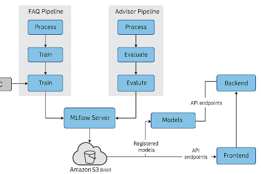
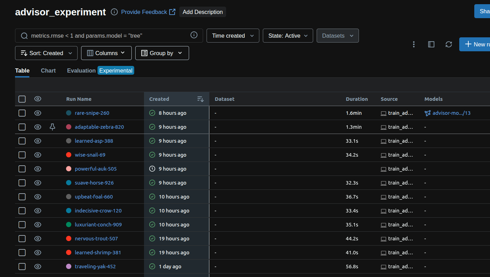
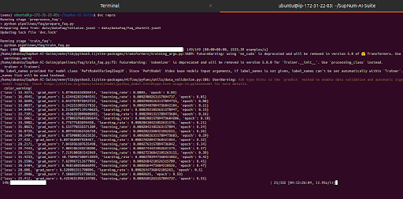
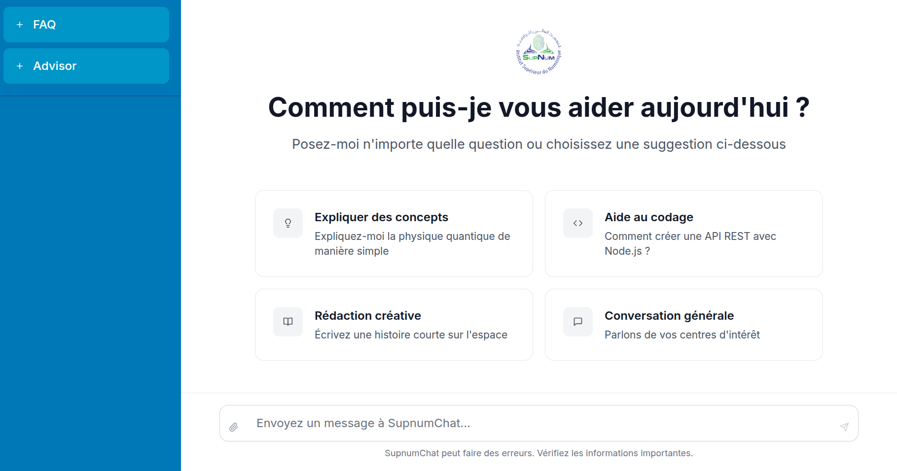

# SupNum AI Suite

## Table des matières

- [Présentation du projet](#présentation-du-projet)
- [Architecture technique](#architecture-technique)
- [Mise en place de l'environnement](#mise-en-place-de-lenvironnement)
- [Captures d'écran](#captures-décran)
- [Bonnes pratiques](#bonnes-pratiques)

## Présentation du projet

SupNum AI Suite a pour objectif de proposer une plateforme complète permettant de gérer un assistant conversationnel destiné aux étudiants. Le projet combine un backend FastAPI, un frontend React/Tailwind ainsi qu'une chaîne MLOps pour l'entraînement et le suivi de modèles de langage.

### Fonctionnalités principales

- **Assistant FAQ** pour répondre rapidement aux questions administratives des étudiants.
- **Assistant Advisor** pour fournir des conseils personnalisés sur l'orientation et la carrière.
- **Interface web réactive** construite avec React et Tailwind pour une expérience utilisateur fluide.
- **Historique des conversations** stocké côté client afin de reprendre un échange à tout moment.
- **Déploiement des modèles** enregistré via MLflow et accessible à l'API pour des réponses en temps réel.

## Architecture technique

La solution s'appuie sur plusieurs composants :

1. **Backend** : API FastAPI qui interroge des modèles enregistrés sur MLflow.
2. **Frontend** : application web React (Vite) pour l'interface utilisateur.
3. **Pipelines de données et de modèles** : orchestrés avec DVC pour la préparation, l'entraînement (LoRA sur T5) et l'évaluation des modèles.
4. **Suivi des expériences** : MLflow pour le tracking et le registry de modèles.

Les données brutes sont stockées sur S3, puis prétraitées et découpées en train/test via `prepare_advisor.py`. Le script `train_advisor.py` entraîne un modèle T5 adapté par LoRA et enregistre les artefacts sur MLflow. Enfin `eval_advisor.py` mesure les performances (ROUGE) et sauvegarde les métriques dans `metrics/`.



## Mise en place de l'environnement

```bash
# Cloner le dépôt
git clone <repo-url>
cd SupNum-AI-Suite

# Installer l'environnement Python
python -m venv venv
source venv/bin/activate
pip install -r requirements.txt

# Récupérer les données et exécuter les pipelines DVC
# (nécessite d'avoir configuré un remote DVC)
dvc pull
dvc repro

# Définir les variables d'environnement nécessaires
export AWS_ACCESS_KEY_ID=<votre-cle>
export AWS_SECRET_ACCESS_KEY=<votre-secret>
export MLFLOW_TRACKING_URI=http://13.48.49.105:5000

# Lancer le backend
uvicorn main:app --host 0.0.0.0 --port 8000

# Lancer le frontend
cd frontend
npm install
npm run dev -- --host 0.0.0.0
```

## Captures d'écran








Le projet met en œuvre des techniques récentes :

- Utilisation de modèles de langage (LLMs) adaptés via **LoRA** sur T5.
- Enregistrement et déploiement de ces modèles avec **MLflow**.
- Gestion des jeux de données et de la reproductibilité grâce à **DVC**.

## Bonnes pratiques

- Historique Git clair pour assurer la traçabilité des développements.
- Pipelines DVC reproductibles pour suivre les expériences et leurs métriques.
- Séparation nette entre le backend, le frontend et les scripts MLOps.
- Un script `debug-mlflow-server.py` aide à diagnostiquer la connexion au serveur MLflow en cas de problème.
